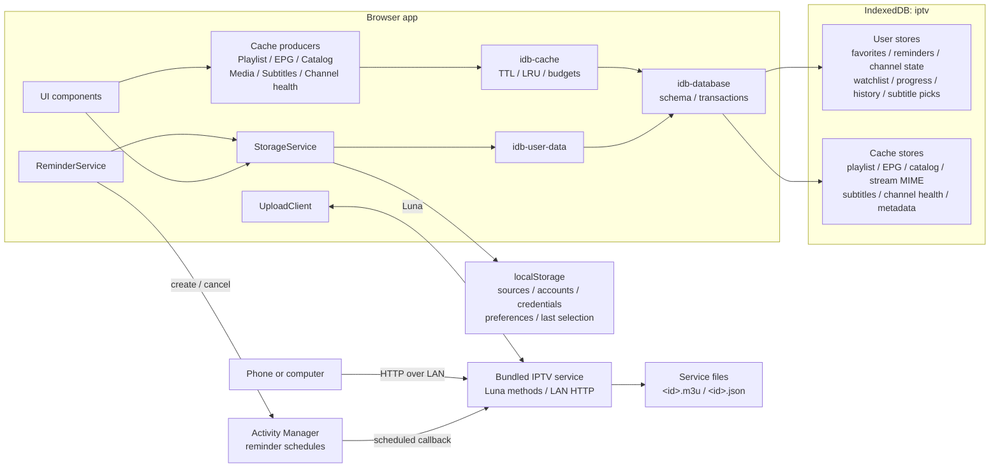

# Storage and Data Management

The app keeps your setup and viewing state on the TV so it can reopen quickly
and remember where you left off. It separates important user data from
downloaded data that can be recreated.

## What is stored

| Data | Examples | Where it is kept | Removed by Clear Cache? |
| --- | --- | --- | --- |
| Setup and preferences | Playlist and EPG sources, Xtream account details, theme, language, text size, time zone, active account and channel | Small app-private browser storage | No |
| Personal data | Favorites, reminders, channel order and names, hidden channels, Watchlist, Recently Watched, playback progress, episode completion, audio and subtitle choices | App-private database on the TV | No |
| Downloaded cache | Parsed playlists, program guides, movie and series catalogs, media metadata, downloaded subtitles, channel health results | App-private database on the TV | Yes |
| LAN-uploaded playlists | Original M3U files uploaded from another device | Private storage owned by the bundled upload service | No |

## Implementation architecture

The persistence layer has four modules with deliberately separate
responsibilities:



- `src/services/storage-service.ts` is the application-facing facade. It keeps
  user data in memory so existing getters remain synchronous.
- `src/services/idb-user-data.ts` owns durable, non-evictable user records and
  serializes their writes.
- `src/services/idb-cache.ts` owns disposable records, byte accounting,
  expiration, LRU access times, budgeting, and eviction.
- `src/services/idb-database.ts` owns the shared IndexedDB schema, connection,
  requests, and transaction completion.
- `bundled-service/src/lan/` runs in the separate Node service because the
  webOS browser sandbox cannot listen on the LAN. `setup/` owns phone setup;
  `upload/` owns persisted M3U files; `backup/` holds only the short-lived
  credential-free archive and pending restore requests.

### localStorage

Small boot-critical values retain the `iptv_` prefix. `StorageService` values
use JSON encoding; the logger's standalone `iptv_log_level` key is a raw string.
This is the complete active key inventory:

| Key | Type | Stored content | Classification |
| --- | --- | --- | --- |
| `iptv_playlists` | `PlaylistEntry[]` | Stable id, display name, source URL/type, uploaded channel count, and Xtream username, password, and live-output preference | Configuration |
| `iptv_epg_url` | `string` | Manually configured XMLTV URL | Configuration |
| `iptv_last_channel` | `number` | Last played channel's array index | Navigation state |
| `iptv_last_channel_key` | `string` | Stable key of the last played channel; survives source reordering | Navigation state |
| `iptv_selectedXtream` | `string \| null` | Account id used by Movies, Series, and Search | Navigation state |
| `iptv_xtream_account_status` | `Record<string, XtreamAccountStatusSnapshot>` | Credential-free state, expiry, connection counts, and checked time keyed by account id | Small derived state |
| `iptv_show_hidden_channels` | `boolean` | Whether normal lists reveal hidden channels in a dimmed state | Preference |
| `iptv_auto_play` | `boolean` | Whether startup automatically plays the selected channel | Preference |
| `iptv_locale` | `string` | Explicit interface locale or `system` | Preference |
| `iptv_playback_track_preferences` | `PlaybackTrackPreferences` | Global preferred audio language and subtitle off/forced/language fallback | Preference |
| `iptv_theme` | `string` | Selected application theme id | Preference |
| `iptv_text_size` | `string` | Selected text-scale id | Preference |
| `iptv_overlay_style` | `dark \| frosted` | Player OSD/sidebar/menu glass style | Preference |
| `iptv_tz_mode` | `device \| feed` | Which time zone displays EPG times | Preference |
| `iptv_epg_tz_offset` | `number \| null` | Last known feed offset in minutes east of UTC | Small derived state |
| `iptv_epg_offsets` | `Record<string, number>` | User time correction in minutes, keyed by EPG source URL | Preference |
| `iptv_online_subtitles` | `OnlineSubtitleConfig` | Preferred language; SubDL and Assrt API keys; OpenSubtitles API key, username, password, access token, and token timestamp | Configuration and credentials |
| `iptv_log_level` | `string` | Optional runtime logger threshold used by diagnostics | Developer preference |

This lets the app discover its sources and render basic preferences before
opening IndexedDB. No fixed Web Storage capacity is assumed: it is intentionally
limited to small values because the effective webOS limit is implementation
dependent and much smaller than the origin quota available to IndexedDB.

If a localStorage write reports quota exhaustion, `StorageService` evicts
derived playlist and stream-MIME data and retries once. A second failure is
reported as `persistence.local.write.failed`; it is not silently treated as a
successful save.

### IndexedDB schema

The database is named `iptv`. webOS already isolates IndexedDB by application
origin, so object-store names do not repeat the `iptv_` prefix.

#### User-data stores

| Object store | Key examples | Additional indexes | Contents |
| --- | --- | --- | --- |
| `favorites` | `favorite:<channel-key>` | None | Stable channel keys |
| `reminders` | `reminder:<channel-key>\|<start-ms>` | None | Channel key/name, EPG source URL, program title, start/stop milliseconds, answered flag; `updatedAt` is the start time |
| `channel-state` | `custom:meta` | None | Customization version, channel/group order, and user-created group keys |
| `channel-state` | `custom:channel:<channel-key>` | None | Optional renamed display name, destination group, and hidden flag |
| `channel-state` | `custom:group:<group-key>` | None | Optional renamed group name and hidden flag |
| `channel-state` | `audio:<channel-key>` | None | Preferred audio rendition name and language |
| `channel-state` | `subtitle:<channel-key>` | None | Explicit off state or preferred subtitle name/language/CC mode |
| `channel-state` | `offset:<channel-key>` | None | Subtitle timing adjustment in seconds |
| `watchlist` | `watch:<account-id>\|<vod-or-series>\|<item-id>` | `scope` | Name, poster, rating, category, extension, and added time; scope is account and content kind |
| `playback-progress` | `resume:<account-id>\|<vod-or-episode>\|<item-id>` | `expiresAt`, `updatedAt` | Position, duration, title/poster/extension snapshot, optional autoplay queue and Watchlist owner |
| `playback-progress` | `completed:<account-id>\|<episode-id>` | `updatedAt` | Account and series ids, episode id, and completion time; completing an episode deletes its resume record in the same transaction |
| `playback-progress` | `catchup:<channel-key>\|<program-start>` | `expiresAt`, `updatedAt` | EPG source URL, program start/stop, title/description/icon snapshot, position, completion, update time, and computed expiry |
| `recently-watched` | `live:<channel-key>` | `updatedAt` | Channel key and last-confirmed watch time; capped to 30 live entries |
| `online-sub-picks` | `pick:<account-id>\|<vod-or-episode>\|<item-id>` | None | Provider id, provider result id, display name, language, and subtitle format |

Every user store uses `key` as its key path. The common record shape is:

```ts
interface UserDataRecord<T> {
  key: string;
  value: T;
  scope?: string;
  updatedAt?: number;
  expiresAt?: number;
}
```

These stores are not included in cache accounting and are never passed to the
eviction algorithm.

#### Cache stores

| Object store | Key path | Indexes | Contents |
| --- | --- | --- | --- |
| `playlist-cache` | `key` | `expiresAt`, `lastAccessedAt` | Key `combined`; payload version, playlist-source signature, ordered batch keys, channel count, derived EPG sources, and timestamp. Bounded `playlist-batch:*` records hold parsed `Channel[]` slices, including playback URLs/headers/catch-up metadata. |
| `epg-cache` | `url` | `expiresAt`, `lastAccessedAt` | Parsed XMLTV channels, aliases/icons, program start/stop/title/description/category/icon, feed offset, optional channel filter, and timestamp |
| `catalog-cache` | `key` | `expiresAt`, `lastAccessedAt` | Xtream categories, VOD/series lists and details, and media-container probes |
| `stream-mime-cache` | `key` | `expiresAt`, `lastAccessedAt` | Normalized provider route mapped to detected MIME and probe time; accounted and evicted in the `catalog` category |
| `subtitle-cache` | `key` | `expiresAt`, `lastAccessedAt` | Provider/result key and downloaded SRT, WebVTT, ASS, or SSA text |
| `channel-health-cache` | `key` | `expiresAt`, `lastAccessedAt` | Per-channel healthy, suspect, or unavailable status from the latest stream check |
| `cache-meta` | `category` | None | `{bytes, entries, updatedAt}` for `playlist`, `epg`, `catalog`, `subtitle`, `health`, and `total` |

Known `catalog-cache` key families are:

```text
<account-id>|vod_categories
<account-id>|vod_streams|<category-id>
<account-id>|vod_all
<account-id>|vod_info|<vod-id>
<account-id>|series_categories
<account-id>|series|<category-id>
<account-id>|series_all
<account-id>|series_info|<series-id>
<account-id>|media_probe|<vod-or-episode>|<item-id>
```

Catalog list/detail payloads contain the provider's normalized names, ids,
posters, ratings, categories, stream extensions, plots, cast, genres, release
data, episode metadata, and sidecar-subtitle descriptors. Media probes contain
the parsed container information used by the OSD, such as codec, resolution,
frame rate, HDR, and audio-channel metadata.

Cache payloads are normalized to a shared envelope:

```ts
interface CacheFields {
  cacheCategory: 'playlist' | 'epg' | 'catalog' | 'subtitle' | 'health';
  createdAt: number;
  updatedAt: number;
  lastAccessedAt: number;
  expiresAt: number | null;
  byteSize: number;
}
```

`byteSize` is the UTF-8 size of the serialized JSON record when `TextEncoder`
is available; the fallback path uses two bytes per JavaScript character. It is
an accounting estimate, not IndexedDB's internal on-disk allocation.

Record mutations and their `cache-meta` changes commit in the same IndexedDB
transaction. Cache mutations also pass through one promise chain so two
concurrent updates cannot apply byte deltas to stale metadata. If metadata is
missing or predates this envelope, the app scans all cache stores and rebuilds
it.

The combined playlist manifest uses the fixed key `combined`, payload version
3, and an FNV-1a signature of the configured playlist JSON. A source edit
therefore invalidates a structurally valid but now unrelated parsed playlist.
Version 2 records with an inline `Channel[]` remain readable as a compatibility
and migration fallback.

Playlist refresh sends at most 500 final merged channels per request to the
classic app worker. The worker waits for each IndexedDB batch transaction before
accepting the next batch, so a slow writer cannot build an unbounded in-memory
queue. Batch records are staged under a unique write id; `combined` is replaced
only after every batch has been written and verified. Reads therefore see either
the previous complete cache or the new complete cache, never a partial refresh.
Aborted and superseded staging records are removed without invalidating the last
committed manifest. If workers are unavailable, the version 2 page writer
remains the compatibility fallback.

### Cache freshness

| Category | Default lifetime | Read behavior |
| --- | --- | --- |
| Playlist | 6 hours | Requires matching payload version, source signature, non-empty channels, and unexpired envelope |
| Program guide | 6 hours | Timestamp drives EPG refresh; expired entries are first-priority cleanup candidates |
| Xtream catalog | 6 hours | Callers use the timestamp for refresh; individual entries may supply another TTL |
| Media probe | No expiry | Stored in the catalog category and still subject to LRU/budget cleanup |
| Stream MIME probe | 7 days | Expired reads become misses; records participate in catalog LRU and accounting |
| Downloaded subtitle | 30 days | An expired read becomes a miss and deletes the record |
| Channel health result | 30 days | Expired results are discarded; a new health check replaces results for checked channels |

Reads update `lastAccessedAt` in a best-effort follow-up transaction. Failure to
write this bookkeeping does not turn a valid cache hit into a miss.

The app does not provide account-based cloud sync. While the app is
foregrounded, the paired LAN setup page can download and restore a versioned
JSON archive of selected favorites, channel customization and EPG mappings,
EPG offsets, Watchlist, appearance/playback preferences, Recently Watched,
resume history, and episode completion history. Merge is idempotent by stable
record key; Replace affects only the selected groups. Unsupported schema
versions and malformed records are rejected before mutation.

The archive deliberately excludes playlists, Xtream accounts and passwords,
credential-bearing URLs, online-subtitle keys and tokens, downloaded
subtitles, caches, reminders, uploaded M3U files, poster/icon URLs, and
transient playback queues. It exists in service memory only for the active LAN
session. Playlist providers and subtitle services still receive the requests
needed to download their content.

Xtream credentials and source URLs are stored in the app's private webOS
storage. They are isolated from other normal TV apps, but the app does not add
its own encryption layer.

## Why the app uses a cache

Program guides and catalogs can be much larger than settings or favorites.
Keeping their processed versions on the TV makes startup, guide reopening, and
catalog browsing faster and reduces repeated provider downloads.

Cached data is disposable. If it expires, is cleared, or is automatically
removed to recover space, the app downloads or rebuilds it when needed. Personal
data is stored separately and is never selected for cache cleanup.

Channel logos are not copied into this managed cache. They use the TV browser's
normal image cache, so the cache total in Settings does not include them.

## Cache size and the displayed budget

Open **Settings -> Data Management** to see the managed cache total and its
breakdown:

- Playlists
- Program guide
- Catalog and media metadata
- Subtitles
- Channel health results

The second number is a **soft cache budget**, not reserved or currently used
space. For example, `1.8 MiB / 75 MiB` means the managed cache currently uses
about 1.8 MiB and may grow toward a 75 MiB target.

The budget adapts to the storage quota reported by
`navigator.storage.estimate()`:

```text
budget = min(floor(reportedQuota * 0.5), 1 GiB)
```

If the TV cannot report a quota, the app uses a 384 MiB fallback budget. The
result can therefore differ between TV models, webOS versions, and available
storage. A displayed budget of 75 MiB is normal when webOS grants the app a
quota of about 150 MiB.

The displayed total covers only the managed cache. Small settings, personal
records, browser-managed image files, and original LAN-uploaded M3U files are
not included.

## Automatic cleanup

The app checks the cache before and after writes. Cleanup begins when the cache
would exceed its soft budget or when overall app storage approaches 80% of the
quota reported by webOS.

Cleanup removes data in this order:

1. Expired entries.
2. Least-recently-used subtitles.
3. Least-recently-used catalog and media metadata.
4. Least-recently-used program guides.
5. Least-recently-used parsed playlists.

This order favors quick startup and live TV while discarding content that is
usually cheap to download again. If webOS still rejects a write because storage
is full, the app performs another cleanup and retries once.

More precisely, an incoming write computes:

```text
cacheOver  = currentManagedCache + incomingDelta - softBudget
originOver = reportedOriginUsage + incomingDelta - 80% of reportedQuota
required   = max(cacheOver, originOver)
```

When `required` is positive, cleanup removes at least that amount plus the
larger of 4 MiB or 10% of the incoming delta. The margin avoids running another
scan immediately after the next small write. A native `QuotaExceededError`
triggers a second path that prunes the incoming record size plus 4 MiB, then
retries the write once.

The category order is implemented after a global expired-record pass. Within
each category, candidates sort by ascending `lastAccessedAt`, giving LRU
behavior among the records known to the cache manager.

## Clear Cache and Reset App

### Clear Cache

**Clear Cache** removes downloaded and processed data, including cached channel
health results. It keeps:

- Accounts and source settings
- App preferences
- Favorites and reminders
- Channel customization
- Watchlist and Recently Watched
- Playback progress
- Audio and subtitle choices
- Original LAN-uploaded M3U files

The next use of a cleared area may be slower while its data is downloaded and
processed again.

### Reset App

**Reset App** permanently removes the app's local setup, personal data, and
managed cache, then restarts at initial setup.

Original LAN-uploaded M3U files belong to the separate LAN service and are
not part of the browser database or cache meter. They should be removed through
the playlist/upload workflow if they must also be deleted; otherwise the app
may discover them again after a reset.

## Storage outside the browser origin

### Bundled-service upload files

The upload store chooses the first writable directory in this order:

```text
WEBOS_UPLOAD_DIR environment override
/media/internal/iptv-uploads
<service-install-directory>/uploads
/tmp/iptv-uploads
```

The first two usable locations are intended to survive reboot. `/tmp` is only a
last-resort fallback and is not persistent across reboot.

Each upload creates two files:

| File | Stored content |
| --- | --- |
| `<id>.m3u` | Original validated M3U text |
| `<id>.json` | `{id, name, count, createdAt}` metadata |

The HTTP `DELETE /uploads/<id>` route deletes both files. The browser-side
`iptv_playlists` entry for an uploaded source is a synchronized reference to
these service-owned files, not another copy of the M3U.

### webOS Activity Manager

Every pending reminder also creates a persistent OS activity named:

```text
iptvReminder-<channel-key>-<start-ms>
```

The activity stores its local scheduled time and callback. In Developer Mode
the callback targets the bundled service and carries the truncated title,
channel name/key, application id, and localized alert labels. In retail mode it
targets `createToast` with the application id and localized message. These OS
activities duplicate only the scheduling information needed to wake at the
correct time; the authoritative reminder record remains in IndexedDB.

Removing or pruning a reminder sends Activity Manager a best-effort cancel by
activity name. Startup reschedules every still-pending reminder with
`replace: true`, repairing missing OS activities without creating duplicates.
Changing an EPG source's time correction migrates reminder and catch-up keys to
the corrected program time. The old reminder activity is canceled and replaced.

### Browser-managed HTTP cache

Channel logos and normal fetched resources may enter Chromium's HTTP cache.
The app does not enumerate or account for those files, and Clear Cache only
clears the app-managed IndexedDB cache. The application does not currently use
the Cache Storage API, `sessionStorage`, or cookies for its own persistence.

## Write ordering and recovery

Changes appear immediately in the interface and are queued for durable storage.
Each logical update diffs the previous and next record sets into `put` and
`delete` operations, then commits them in one transaction for that store.
`idb-user-data` serializes all writes through `writeChain`, preserving call
order even when a prior operation rejects. The first asynchronous failure is
latched for the next flush.

The app flushes pending writes when it moves to the background and before an
explicit exit. A failed flush triggers one recovery attempt:

1. Serialize the complete current in-memory user-data snapshot.
2. Replace all seven user-data stores in one transaction.
3. Wait for the write chain again.

If recovery succeeds, the flush emits a recovered event. If it still fails, an
explicit exit is canceled, the app remains open, and a save-failure toast is
shown instead of silently losing the latest changes.

When IndexedDB cannot open, initialization logs the failure. Destructive
operations such as Clear Cache and Reset App do not report success when
IndexedDB is unavailable.

### Reset transaction order

Reset is intentionally ordered so local configuration is not erased before a
database failure can be reported:

1. Clear all derived cache stores and `cache-meta`.
2. Clear all user-data stores and internal metadata.
3. Clear localStorage.
4. Emit the completion event.
5. Reload the app.

If either database clear fails, Settings shows an error and leaves the
remaining local configuration intact.

## Diagnostics

Persistence logs use stable component tags:

| Tag | Responsibility |
| --- | --- |
| `PersistenceDB` | Open, blocked open, and schema upgrade |
| `CacheStorage` | Cache reads, writes, accounting, quota, eviction, and clear |
| `UserDataStorage` | User-record writes, recovery, and clear |
| `StorageService` | localStorage quota handling and facade initialization |
| `App` | Background/exit flush and whole-app reset |

Important records include machine-readable `event=` fields such as
`persistence.cache.budget.exceeded`, `persistence.user.flush.recovered`, and
`persistence.reset.completed`. `scripts/tv.sh diag` uses these events to report
quota, write, flush, and reset failures without parsing prose.

`src/services/persistence-diagnostics.test.ts` statically enforces that every
info, warning, and error emitted by the persistence modules carries an event
identifier.

Because there is no cloud backup, **Reset App**, uninstalling the app, or
clearing its webOS application data can permanently remove local user data.
